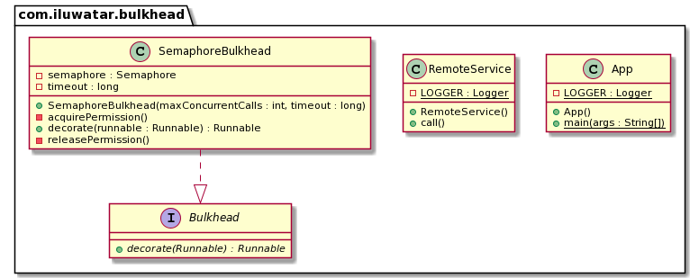

## Intent

A type of application design that is tolerant of failure. In a bulkhead architecture, elements of an application are isolated into pools so that if one fails, it will not exhaust resources of other applications. The others will continue to function.

## Explanation

Real world example

> A server has a default request handling thread pool size of 200 threads.
> One application service A calls Redis which has a problem and never finishes.
> Since other threads always finish, gradually all threads will be used by application service A and blocked by Redis.
> The server cannot take requests from other application service anymore.

In plain words

> Bulkhead limits the resources one component could use.

Wikipedia says

> A stability pattern used to protect distributed software applications.

**Programmatic Example**

The `Bulkhead` interface has a method to decorate runnable with the bulkhead constraint.
It limits the number of concurrent call. If one runnable blocks, it will not exhaust all the threads in the server.

```java
public interface Bulkhead {

  /**
   * Decorates a runnable such that the runnable have to wait or timeout
   * when the number of concurrent threads has reached the bulkhead limit.
   *
   * @param runnable the original Runnable.
   * @return a runnable which is decorated by a bulkhead.
   */
  Runnable decorate(final Runnable runnable);
}
```

One implementation of `bulkhead` is using `Semaphore`.

```java
/**
 * A bulkhead implementation based on a semaphore.
 */
public class SemaphoreBulkhead implements Bulkhead {

  private final Semaphore semaphore;

  private final long timeout;

  /**
   * Creates a bulkhead with the max number of concurrent calls and timeout value.
   *
   * @param maxConcurrentCalls the max number of concurrent calls the bulkhead allows.
   * @param timeout the timeout value a call should wait.
   */
  public SemaphoreBulkhead(final int maxConcurrentCalls, final long timeout) {
    this.timeout = timeout;
    this.semaphore = new Semaphore(maxConcurrentCalls, true);
  }

  /**
   * {@inheritDoc}
   * @throws IllegalThreadStateException when the bulkhead is full
   * @throws IllegalStateException if the thread is interrupted during waiting for permission
   */
  @Override
  public Runnable decorate(final Runnable runnable) {
    return () -> {
      acquirePermission();
      try {
        runnable.run();
      } finally {
        releasePermission();
      }
    };
  }

  private void acquirePermission() {
    try {
      boolean acquired = semaphore.tryAcquire(timeout, TimeUnit.MILLISECONDS);
      if (!acquired) {
        throw new IllegalThreadStateException("Bulkhead full of threads");
      }
    } catch (final InterruptedException e) {
      throw new IllegalStateException("Bulkhead acquire permission cancelled", e);
    }
  }

  private void releasePermission() {
    semaphore.release();
  }
}
```

A mocked `RemoteService` represents the remote call which could block.

```java
/**
 * A mocked remote service.
 */
@Slf4j
public class RemoteService {

  /**
   * A mocked remote call which takes 2 seconds to finish.
   */
  public void call() {
    try {
      LOGGER.info("starts");
      Thread.sleep(2000);
      LOGGER.info("finishes");
    } catch (final InterruptedException e) {
      LOGGER.error("Thread interrupted: ", e);
    }
  }
}
```

Finally the app simulates the behavior when 20 threads make calls to the remote service.

```java
/**
 * The Bulkhead pattern is a type of application design that is tolerant of failure. In a bulkhead
 * architecture, elements of an application are isolated into pools so that if one fails, it will
 * not exhaust resources of other applications.
 *
 * <p>In the below example, it uses a bulkhead to control the calls to a remote service. The
 * number of maximum concurrent calls is set to 5, and the waiting time is 5s.
 *
 * <p>Twenty mocked 2s remote service calls are called sequentially. The 1 - 5 calls should start
 * immediately. The 6 - 10 calls should start one by one after 1 - 5 calls finishes. The 11 - 15
 * calls should start one by one after 6 - 10 calls finishes. The 16 - 20 calls should throw
 * "Bulkhead full of threads" exception after 5s waiting time is over.
 */
@Slf4j
public class App {
  /**
   * Program entry point.
   *
   * @param args command line args.
   * @throws InterruptedException if an InterruptedException occurs.
   */
  public static void main(final String[] args) throws InterruptedException {
    final RemoteService remoteService = new RemoteService();
    final Bulkhead bulkhead = new SemaphoreBulkhead(5, 5000);
    final Runnable runnable = () -> remoteService.call();
    final Runnable runnableWithBulkhead = bulkhead.decorate(runnable);

    final Thread[] threads = new Thread[20];
    for (int i = 0; i < 20; i++) {
      final Thread t = new Thread(() -> {
        try {
          runnableWithBulkhead.run();
        } catch (final Exception e) {
          LOGGER.error("Exception: " + e.getMessage());
        }
      }, "Remote service call " + (i + 1));
      threads[i] = t;
      t.start();
      Thread.sleep(50);
    }

    for (Thread t : threads) {
      t.join();
    }
  }
}
```

The App log output:

```java
20:31:40.613 [Remote service call 1] INFO com.iluwatar.bulkhead.RemoteService - starts
20:31:40.658 [Remote service call 2] INFO com.iluwatar.bulkhead.RemoteService - starts
20:31:40.709 [Remote service call 3] INFO com.iluwatar.bulkhead.RemoteService - starts
20:31:40.761 [Remote service call 4] INFO com.iluwatar.bulkhead.RemoteService - starts
20:31:40.813 [Remote service call 5] INFO com.iluwatar.bulkhead.RemoteService - starts
20:31:42.621 [Remote service call 1] INFO com.iluwatar.bulkhead.RemoteService - finishes
20:31:42.622 [Remote service call 6] INFO com.iluwatar.bulkhead.RemoteService - starts
20:31:42.661 [Remote service call 2] INFO com.iluwatar.bulkhead.RemoteService - finishes
20:31:42.662 [Remote service call 7] INFO com.iluwatar.bulkhead.RemoteService - starts
20:31:42.714 [Remote service call 3] INFO com.iluwatar.bulkhead.RemoteService - finishes
20:31:42.715 [Remote service call 8] INFO com.iluwatar.bulkhead.RemoteService - starts
20:31:42.765 [Remote service call 4] INFO com.iluwatar.bulkhead.RemoteService - finishes
20:31:42.766 [Remote service call 9] INFO com.iluwatar.bulkhead.RemoteService - starts
20:31:42.819 [Remote service call 5] INFO com.iluwatar.bulkhead.RemoteService - finishes
20:31:42.819 [Remote service call 10] INFO com.iluwatar.bulkhead.RemoteService - starts
20:31:44.625 [Remote service call 6] INFO com.iluwatar.bulkhead.RemoteService - finishes
20:31:44.627 [Remote service call 11] INFO com.iluwatar.bulkhead.RemoteService - starts
20:31:44.666 [Remote service call 7] INFO com.iluwatar.bulkhead.RemoteService - finishes
20:31:44.667 [Remote service call 12] INFO com.iluwatar.bulkhead.RemoteService - starts
20:31:44.715 [Remote service call 8] INFO com.iluwatar.bulkhead.RemoteService - finishes
20:31:44.716 [Remote service call 13] INFO com.iluwatar.bulkhead.RemoteService - starts
20:31:44.768 [Remote service call 9] INFO com.iluwatar.bulkhead.RemoteService - finishes
20:31:44.769 [Remote service call 14] INFO com.iluwatar.bulkhead.RemoteService - starts
20:31:44.822 [Remote service call 10] INFO com.iluwatar.bulkhead.RemoteService - finishes
20:31:44.822 [Remote service call 15] INFO com.iluwatar.bulkhead.RemoteService - starts
20:31:46.404 [Remote service call 16] ERROR com.iluwatar.bulkhead.App - Exception: Bulkhead full of threads
20:31:46.448 [Remote service call 17] ERROR com.iluwatar.bulkhead.App - Exception: Bulkhead full of threads
20:31:46.504 [Remote service call 18] ERROR com.iluwatar.bulkhead.App - Exception: Bulkhead full of threads
20:31:46.555 [Remote service call 19] ERROR com.iluwatar.bulkhead.App - Exception: Bulkhead full of threads
20:31:46.604 [Remote service call 20] ERROR com.iluwatar.bulkhead.App - Exception: Bulkhead full of threads
20:31:46.628 [Remote service call 11] INFO com.iluwatar.bulkhead.RemoteService - finishes
20:31:46.667 [Remote service call 12] INFO com.iluwatar.bulkhead.RemoteService - finishes
20:31:46.720 [Remote service call 13] INFO com.iluwatar.bulkhead.RemoteService - finishes
20:31:46.771 [Remote service call 14] INFO com.iluwatar.bulkhead.RemoteService - finishes
20:31:46.825 [Remote service call 15] INFO com.iluwatar.bulkhead.RemoteService - finishes
```

## Class diagram



## Applicability

Use the Bulkhead in any of the following situations:

* When you want to isolate resources used by a component.

## Credits

* [Resilience4j | Bulkhead basics & runtime behavior | Simple example for beginners](https://itsallbinary.com/resilience4j-bulkhead-basics-runtime-behavior-simple-example-for-beginners/)
* [resilience4j](https://github.com/resilience4j/resilience4j/tree/master/resilience4j-bulkhead/src/main/java/io/github/resilience4j)
* [Implementing Bulkhead with Resilience4j](https://reflectoring.io/bulkhead-with-resilience4j/)