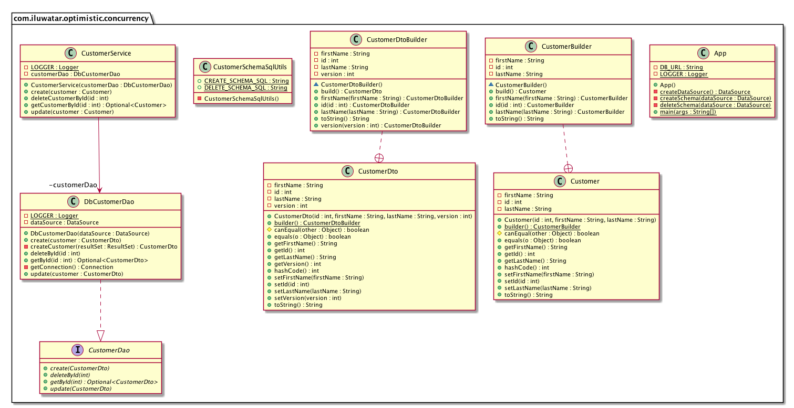

## Intent

Optimistic concurrency protect data integrity by checking data conflict before commit. It allows parallel data process before commit to increase performance.

## Explanation

Real world example

> A user reads a value from the database, when it commits it checks whether another user modifies the value after its read.
> For example, Alice and Bob are using a website to book tickets for a specific show. Only one ticket is left for the specific show. Alice signs on first to see that only one ticket is left, and finds it expensive. Alice takes time to decide. Bob signs on and also finds one ticket left, and orders it instantly. Bob purchases and logs off. Alice decides to buy a ticket, to find there are no tickets.

In plain words

> Optimistic concurrency is a way to prevent data read-write conflict.

Wikipedia says

> Optimistic concurrency control (OCC), also known as optimistic locking, is a concurrency control method applied to transactional systems such as relational database management systems and software transactional memory.
> OCC assumes that multiple transactions can frequently complete without interfering with each other. While running, transactions use data resources without acquiring locks on those resources. Before committing, each transaction verifies that no other transaction has modified the data it has read.

**Programmatic Example**

Walking through our customers example, here's the `CustomerDto` entity which represents a database row with version column.

```java
/**
 * A customer POJO that represents the data that will be read from the data source.
 */
@Data
@Builder
@AllArgsConstructor
public class CustomerDto {
  private int id;
  private String firstName;
  private String lastName;
  private int version;
}
```

Here's the `CustomerDao` interface and the database implementations for it.
the `void update(CustomerDto customer)` method updates data only when the version of the updated data matches the database version.

```java
/**
 * The Data Access Object (DAO) that provides an interface to database.
 */
public interface CustomerDao {

  // CS427 Issue link: https://github.com/iluwatar/java-design-patterns/issues/1280
  /**
   * Get customer as Optional by id.
   *
   * @param id unique identifier of the customer.
   * @return an optional with customer if a customer exists, empty optional otherwise.
   */
  Optional<CustomerDto> getById(int id);

  // CS427 Issue link: https://github.com/iluwatar/java-design-patterns/issues/1280
  /**
   * Create a customer.
   *
   * @param customer the customer to be created.
   */
  void create(CustomerDto customer);

  // CS427 Issue link: https://github.com/iluwatar/java-design-patterns/issues/1280
  /**
   * Update a customer.
   *
   * @param customer the customer to be updated.
   */
  void update(CustomerDto customer);

  // CS427 Issue link: https://github.com/iluwatar/java-design-patterns/issues/1280
  /**
   * Delete a customer.
   *
   * @param id identify the customer to be deleted.
   */
  void deleteById(int id);
}

@Slf4j
@RequiredArgsConstructor
public class DbCustomerDao implements CustomerDao {
    ...
  public void update(CustomerDto customer) {
    try (var connection = getConnection();
         var statement = connection.prepareStatement(
                 "UPDATE CUSTOMERS SET FNAME = ?, LNAME = ?, VERSION = ? "
                        + "WHERE ID = ? AND VERSION = ?")) {
      statement.setString(1, customer.getFirstName());
      statement.setString(2, customer.getLastName());
      statement.setInt(3, customer.getVersion() + 1);
      statement.setInt(4, customer.getId());
      statement.setInt(5, customer.getVersion());
      if (statement.executeUpdate() == 0) {
        throw new CustomException(
          String.format("Failed to update customer with Id: %d", customer.getId()));
      }
    } catch (final SQLException ex) {
      throw new CustomException(
        String.format("Failed to update customer with Id: %d", customer.getId()), ex);
    }
  }
  ...
}
```

Here's the `CustomerService` which hide details like optimistic concurrency control in the infrastructure layer.
The client doesn't need to know which version it should use.
And switching from version to timestamp implementation will not affect client's code.

```
/**
 * A domain service which manages customer and hide details like optimistic concurrency
 * control in the infrastructure layer.
 */
@Slf4j
@RequiredArgsConstructor
public class CustomerService {

    private final DbCustomerDao customerDao;
    ...
    // CS427 Issue link: https://github.com/iluwatar/java-design-patterns/issues/1280
    /**
     * Update a customer.
     *
     * @param customer the customer to be updated.
     */
    public void update(Customer customer) {
        final CustomerDto customerDto = customerDao.getById(customer.getId())
                .orElseThrow(() -> new CustomException(
                        String.format("No customer with Id: %d exists", customer.getId())));
        customerDao.update(CustomerDto.builder()
            .id(customer.getId())
            .firstName(customer.getFirstName())
            .lastName(customer.getLastName())
            .version(customerDto.getVersion())
            .build());
    }
    ...
}
```

Finally here's how we use `CustomerService` to manage customers. First the customer is created with version
zero, then it is updated with version one.

```java
/**
 * Optimistic concurrency protect data integrity by checking data conflict before commit.
 * It allows parallel data process before commit to increase performance.
 *
 * <p>In an optimistic concurrency model, a violation is considered to have occurred if,
 * after a user receives a value from the database, another user modifies the value before
 * the first user has attempted to modify it.
 *
 * <p>The simplest strategy for optimistic concurrency is to implement a versioning scheme.
 * Each entity under concurrency control is given a version identifier, which is changed
 * every time the data is altered. When modifying an object, you note the version number,
 * make your changes, and commit those changes if someone else hasn't changed the version number
 * of the underlying object since you started making your changes.
 *
 * <p>In the following example, customer is created with version 0. When the customer is updated,
 * the version is updated to 1.
 */
@Slf4j
public class App {
  private static final String DB_URL = "jdbc:h2:~/optimistic-concurrency";

  // CS427 Issue link: https://github.com/iluwatar/java-design-patterns/issues/1280
  /**
   * Program entry point.
   *
   * @param args command line args.
   */
  public static void main(final String[] args) {

    final var dataSource = createDataSource();

    try {
      createSchema(dataSource);
      final var dbDao = new DbCustomerDao(dataSource);
      final var customerService = new CustomerService((dbDao));

      final var customerToCreate =
              Customer.builder().id(1).firstName("Dan").lastName("Danson").build();
      customerService.create(customerToCreate);
      LOGGER.info("Create " + customerToCreate);
      LOGGER.info("Customer data entry created with version 0: "
              + dbDao.getById(1).get().toString());

      final var customerToUpdate =
              Customer.builder().id(1).firstName("Dan").lastName("Danson").build();
      customerService.update(Customer.builder().id(1).firstName("Han").lastName("Danson").build());
      LOGGER.info("Update " + customerToUpdate);
      LOGGER.info("Customer data entry updated with version 1: "
              + dbDao.getById(1).get().toString());

      deleteSchema(dataSource);
    } catch (final SQLException ex) {
      LOGGER.error("Application fail: " + ex.getMessage());
    }
  }
```

The program output:

```java
22:01:57.767 [main] INFO com.iluwatar.optimistic.concurrency.App - Create Customer(id=1, firstName=Dan, lastName=Danson)
22:01:57.851 [main] INFO com.iluwatar.optimistic.concurrency.App - Customer data entry created with version 0: CustomerDto(id=1, firstName=Dan, lastName=Danson, version=0)
22:01:57.886 [main] INFO com.iluwatar.optimistic.concurrency.App - Update Customer(id=1, firstName=Dan, lastName=Danson)
22:01:57.910 [main] INFO com.iluwatar.optimistic.concurrency.App - Customer data entry updated with version 1: CustomerDto(id=1, firstName=Han, lastName=Danson, version=1)
```

## Class diagram



## Applicability

Use the Optimistic Concurrency in any of the following situations:

* When you want protect data integrity but cannot use Pessimistic Concurrency control.
* When you want to have high performance for concurrency control.
* When data conflict is rare.

## Credits

* [J2EE Design Patterns](https://www.amazon.com/gp/product/0596004273/ref=as_li_tl?ie=UTF8&camp=1789&creative=9325&creativeASIN=0596004273&linkCode=as2&tag=javadesignpat-20&linkId=48d37c67fb3d845b802fa9b619ad8f31)
* [Data Access Object Design Patterns](https://github.com/iluwatar/java-design-patterns/tree/master/dao)
* [How to code optimistic and pessimistic locking from java code](https://stackoverflow.com/questions/8691684/how-to-code-optimistic-and-pessimistic-locking-from-java-code)
* [Optimistic vs. Pessimistic locking](https://stackoverflow.com/questions/129329/optimistic-vs-pessimistic-locking)